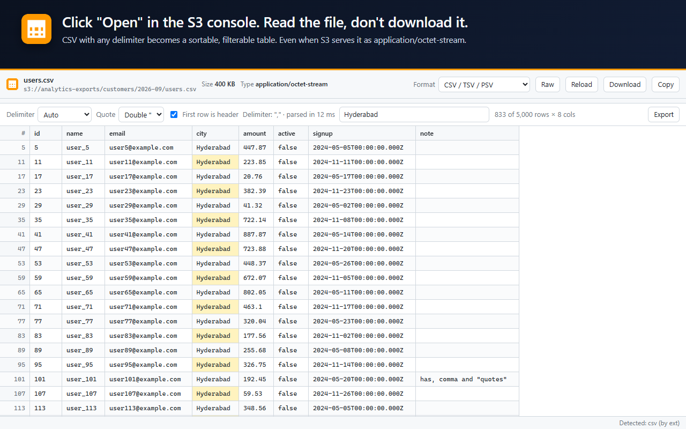
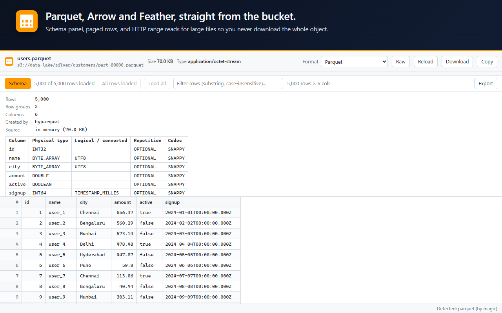
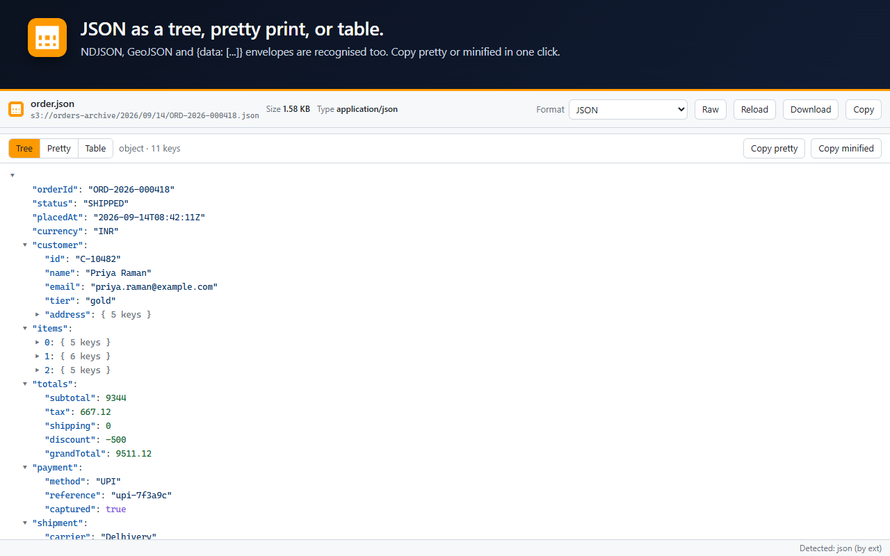
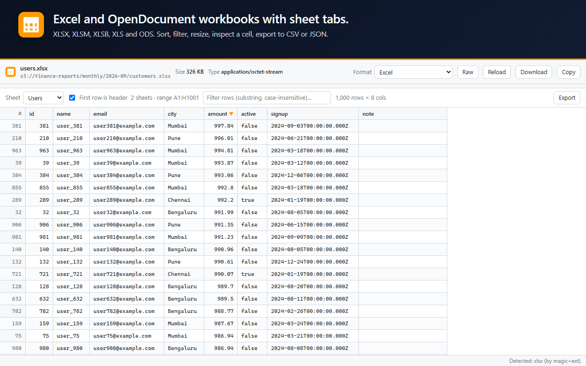
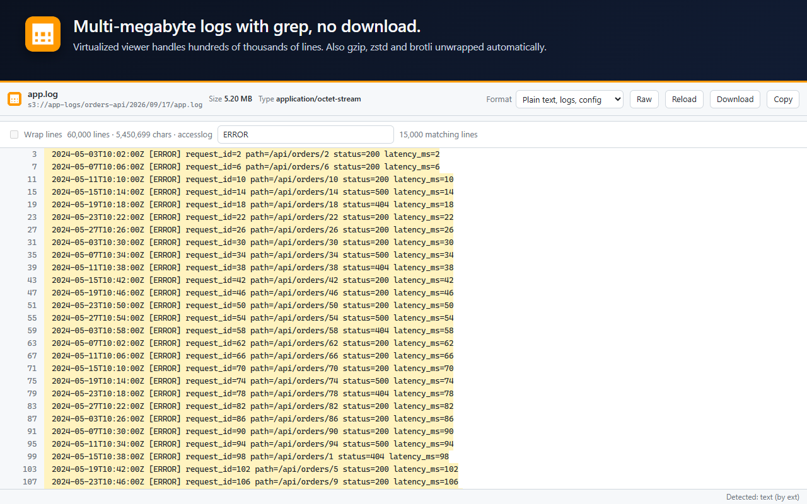

# S3 Any Viewer

[](https://github.com/mohan-lal/s3-any-viewer/actions/workflows/build.yml)
[](LICENSE)


**Click "Open" on any object in the AWS S3 console and read it right there, in the browser, nicely formatted.**

CSV becomes a sortable table (any delimiter). JSON becomes a tree. Parquet, Arrow and Excel become tables with a schema panel. XML is pretty-printed. Images, PDF, video and ZIP contents just show up. Anything unknown gets a hex dump. No more S3 Select, no more "pick a type before you query", no more downloading a file just to peek inside it.

> **Zero credentials.** The console's *Open* button already creates a short-lived presigned URL for the object. The extension intercepts that navigation and renders the bytes on the client. No AWS keys are involved, and the only network request is the one the console would have made anyway.



<details>
<summary>More screenshots</summary>






</details>

---

## Table of contents

- [Why](#why)
- [How it works](#how-it-works)
- [Supported formats](#supported-formats)
- [Install](#install)
- [Usage](#usage)
- [Development](#development)
- [Architecture](#architecture)
- [Security and privacy](#security-and-privacy)
- [Limitations and roadmap](#limitations-and-roadmap)
- [Contributing](#contributing)
- [License](#license)

## Why

Reading a file that lives in S3 is harder than it should be:

| Pain | What happens today | With S3 Any Viewer |
|---|---|---|
| Quick look at a CSV, JSON or log | Download, find it in the Downloads folder, open another app | Click **Open**, read it in a tab |
| S3 Select | Choose input format, compression and output format per query, hit size and record limits | Not needed for reading |
| Generic `Content-Type` (`application/octet-stream`) | Browser forces a download | Format detected from bytes and file name |
| Parquet / Arrow | Needs a notebook or a CLI tool | Table with schema, paged, range-read for large files |
| A `.csv.gz` or `events.json.gz` | Download, unzip, open | Decompressed transparently |

## How it works

```
S3 console "Open"  ──►  window.open(https://bucket.s3.region.amazonaws.com/key?X-Amz-Signature=…)
                                                │
                    declarativeNetRequest redirect (main_frame, SigV4 query present)
                                                │
                                                ▼
                           chrome-extension://…/viewer.html#u=<presigned URL>
                                                │
                        fetch(bytes) ─► unwrap gzip/zstd/br ─► detect ─► render
```

1. **Intercept.** The service worker installs three dynamic `declarativeNetRequest` rules. A high-priority *allow* rule matches `response-content-disposition=attachment`, so the console's **Download** button keeps downloading. Two *redirect* rules, one for the global partition and one for AWS China, match any top-level navigation to a presigned `*.amazonaws.com` URL and send it to the viewer page, carrying the original URL in the fragment.
2. **Load.** The viewer probes the size with a 1-byte range request, then streams the object with a progress bar. Objects above 256 MB prompt for a partial preview. Parquet files above 32 MB are not downloaded at all; the footer and the requested row groups are fetched with HTTP range requests.
3. **Detect.** Magic bytes first (PAR1, ARROW1, %PDF, PK, 1F 8B, …), then the file extension, then the `Content-Type`, then content sniffing for text (JSON vs NDJSON vs XML vs delimited). The result can be overridden from the header at any time.
4. **Render.** Each format has a small renderer module. All tabular formats share one virtualized table with sorting, filtering, resizing, cell inspection and export.

## Supported formats

| Category | Formats | Presentation |
|---|---|---|
| **Delimited** | CSV, TSV, PSV, `;` `:` space `\x01` or any custom delimiter, with or without header row | Virtual table, delimiter auto-detected and overridable, quote character selectable |
| **JSON** | JSON, GeoJSON, HAR, NDJSON / JSON Lines | Lazy tree with search over keys and values, highlighted pretty print, table for arrays of objects and `{ data: [...] }` envelopes |
| **Columnar** | Parquet (snappy, gzip, zstd, lz4, brotli), Arrow IPC, Feather | Table with schema panel, paged loading, range reads for large files |
| **Spreadsheets** | XLSX, XLSM, XLSB, XLS, ODS, FODS, SYLK, DIF, PRN | Sheet tabs, header toggle |
| **Markup** | XML, RSS, Atom, plist, POM, KML, GPX, WSDL, XSD | Pretty print, raw, table of repeating elements |
| **Config** | YAML, TOML, INI, `.env`, `.properties`, `.conf` | Highlighted source, JSON tree for YAML and TOML |
| **Documents** | Markdown, HTML | Rendered (sanitized) or sandboxed preview, with source toggle |
| **Text and code** | Logs, plain text, SQL, Python, JavaScript / TypeScript, Java, Kotlin, Go, Rust, C / C++, C#, Ruby, PHP, shell, PowerShell, Dockerfile, Terraform, Protobuf, GraphQL and about 30 more | Syntax highlighting with line numbers; search that filters to matching lines with highlights and match navigation; virtualized for large logs |
| **Images** | PNG, JPEG, GIF, WebP, BMP, ICO, AVIF, SVG | Fit / 100 % zoom, dimensions; SVG also shows source |
| **PDF** | PDF | Browser PDF viewer |
| **Media** | MP4, WebM, OGG, MOV, MP3, WAV, FLAC, M4A, AAC | Native player |
| **Archives** | ZIP, JAR, WAR, EPUB, WHL, NUPKG, XPI; DOCX / PPTX as containers | Entry list with filter; click an entry to open it in the viewer (recursive) |
| **Compression** | `.gz`, `.zst`, `.br` wrapping any of the above | Transparent, nested layers supported |
| **Everything else** | Avro, ORC, SQLite, TIFF, bz2, xz, 7z, RAR, unknown binaries | Hex dump with an explanatory note |

## Install

Requires Chrome 120 or later, or an equivalent Chromium browser.

### Chrome and other Chromium browsers

**[Install from the Chrome Web Store](https://chromewebstore.google.com/detail/s3-any-viewer/embhbifddhjedfffkoapiakkabjlhdjf)**

Tested on Chrome. Brave, Vivaldi and other Chromium browsers install from the same listing and should work, since the extension uses only standard Manifest V3 APIs, but they are untested. Opera needs its own helper extension before it can install from the Chrome Web Store. If you hit a problem on one of these, please open an issue.

### Microsoft Edge

Search for **S3 Any Viewer** in the [Edge Add-ons store](https://microsoftedge.microsoft.com/addons). Edge also runs Chrome extensions, so the Chrome Web Store link above works there as well, once you accept the "Allow extensions from other stores" prompt Edge shows on that page.

### From source

```bash
git clone https://github.com/mohan-lal/s3-any-viewer.git
cd s3-any-viewer
npm install
npm run build
```

1. Open `chrome://extensions`.
2. Turn on **Developer mode** (top right).
3. Click **Load unpacked** and select the **`dist`** folder.

> When the folder picker opens, make sure `dist` itself is selected and not its `icons` subfolder, or Chrome reports "Manifest file is missing or unreadable".

### From a release zip

Download `s3-any-viewer-<version>.zip` from the [Releases](https://github.com/mohan-lal/s3-any-viewer/releases) page, unzip it, and load the unzipped folder the same way.

## Usage

- **From the S3 console:** select an object and click **Open**. The viewer opens in the new tab.
- **From any link:** right-click a link and choose **Open link in S3 Any Viewer**.
- **From the toolbar popup:** paste a URL (S3-compatible stores and CloudFront are supported after a one-time permission prompt) or open a local file.
- **In the viewer:** change the **Format** dropdown to override detection, click **Raw** to see the plain text, **Download** to save the original bytes, **Copy** to copy the decoded text. In tables, click a header to sort, type in the filter box to search all columns, double-click a cell to see the full value, and use **Export** for CSV, TSV, JSON or clipboard. In text views and the JSON tree, type in the search box to show only matching lines or branches with the term highlighted, then press **Enter** or **Shift+Enter** to step through matches. **Escape** clears the search.
- **Turn it off temporarily:** untick "Intercept S3 Open links" in the popup. The badge shows `off`.

## Development

```bash
npm run watch       # rebuild on change (reload the extension card afterwards)
npm run fixtures    # write sample files of every supported format to ./fixtures
npm run serve       # serve dist + fixtures at http://localhost:8765
npm run package     # zip dist into release/s3-any-viewer-<version>.zip
```

With the dev server running, the viewer can be exercised in a normal tab without the extension:

```
http://localhost:8765/viewer.html#u=http://localhost:8765/fixtures/users.parquet
```

Append `?ct=application/octet-stream` to a fixture URL to test detection without a content type, or `?gz=1` to test gzip unwrapping.

## Architecture

```
src/
├── manifest.json          MV3 manifest (declarativeNetRequestWithHostAccess, storage, contextMenus; amazonaws.com hosts)
├── background.js          service worker: installs / toggles the redirect rules, context menu
├── popup/                 toolbar popup: interception toggles, open URL / local file, format list
├── viewer/
│   ├── viewer.html/.css   viewer shell: header, toolbar, content, status bar
│   └── viewer.js          orchestration: load → decompress → detect → render, format override, zip drill-down
├── lib/
│   ├── formats.js         format registry (labels, extensions, highlight.js language map)
│   ├── detect.js          magic bytes → extension → content type → sniffing
│   ├── source.js          fetch with progress, size probe, range reads, gzip/zstd/brotli, S3 URL parsing
│   ├── vtable.js          virtualized table: sort, filter, resize, cell detail, export
│   └── util.js            DOM helper, text decoding, object flattening, formatting
└── renderers/             one module per format family; all receive the same ctx object
```

Bundled with [esbuild](https://esbuild.github.io/) into `dist/`. No framework, no runtime dependencies beyond the parsers: [PapaParse](https://www.papaparse.com/), [hyparquet](https://github.com/hyparam/hyparquet), [Apache Arrow JS](https://arrow.apache.org/docs/js/), [SheetJS](https://sheetjs.com/), [highlight.js](https://highlightjs.org/), [marked](https://marked.js.org/), [DOMPurify](https://github.com/cure53/DOMPurify), [js-yaml](https://github.com/nodeca/js-yaml), [smol-toml](https://github.com/squirrelchat/smol-toml), [fflate](https://github.com/101arrowz/fflate).

## Security

The extension works from the presigned URL the S3 console generates when you click **Open**. It redirects that navigation to its own page and fetches the object once, with cookies disabled (`credentials: "omit"`). The console session is not involved: the extension has no content script on any AWS page and no permission to read cookies, tabs or history, and Chrome enforces that list regardless of what the code contains.

| Permission | Used for |
|---|---|
| `declarativeNetRequestWithHostAccess` | Redirect presigned `*.amazonaws.com` navigations to the viewer. Rules can only act on hosts the extension already holds permission for, and this API cannot read request or response contents. |
| `storage` | Two on/off preferences. |
| `contextMenus` | The "Open link in S3 Any Viewer" entry. |
| Host `*.amazonaws.com`, `*.amazonaws.com.cn` | Fetch the object bytes. Does not cover `console.aws.amazon.com`. |
| Optional `<all_urls>` | Granted per site, only when you open a non-AWS URL yourself. Revocable in the extension's details page. |

Rendering is inert: HTML previews run in an iframe with an empty `sandbox`, Markdown is sanitised with DOMPurify, and SVG is displayed through ``. There is no telemetry and no remote code; every library is bundled at build time. Presigned URLs are kept in the URL fragment, so they are never sent in a `Referer` header, and are removed from the address bar once loading starts.

[SECURITY.md](SECURITY.md) has the data-flow diagram, the threat model, a verification checklist for reviewers, and how to confirm that a released package was built from this repository. Data handling is summarised in [PRIVACY.md](PRIVACY.md).

## Limitations and roadmap

- Avro, ORC and SQLite are shown as hex for now. Avro (`avsc`) and SQLite (`sql.js`) are planned.
- Very large CSV / NDJSON objects are loaded into memory up to a cap, then offered as a partial preview. Streaming parsing is planned.
- Column type inference and per-column statistics in the table view.
- Firefox build (same code; needs `browser_specific_settings` and a `webRequest` fallback for the redirect).

## Contributing

Issues and pull requests are welcome. Please read [CONTRIBUTING.md](CONTRIBUTING.md) for the development loop and the rules on security and bundle size.

## License

[MIT](LICENSE) © 2026 Mohanlal
